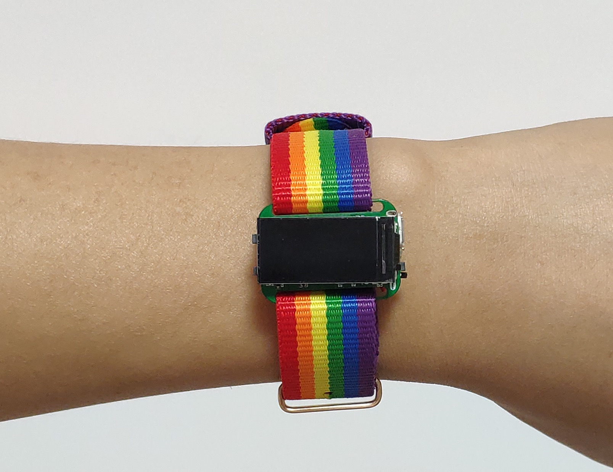
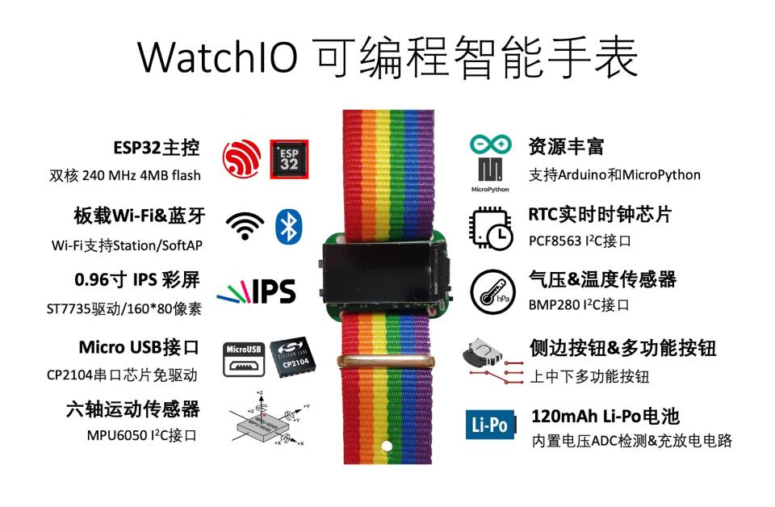
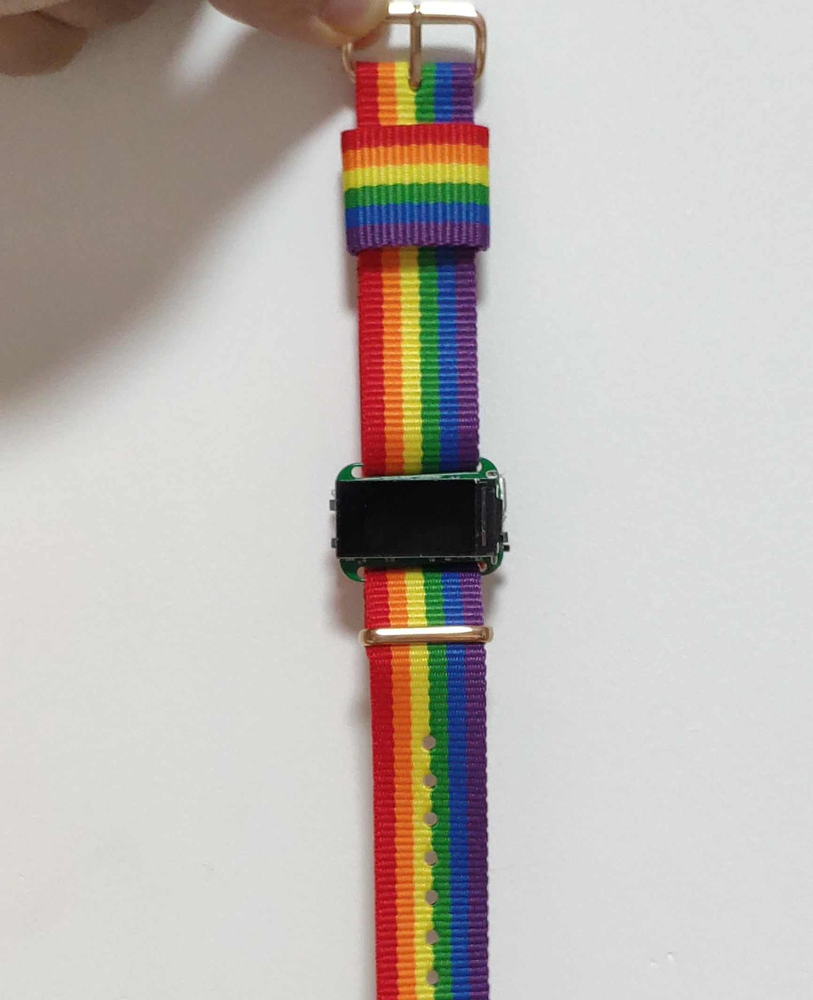
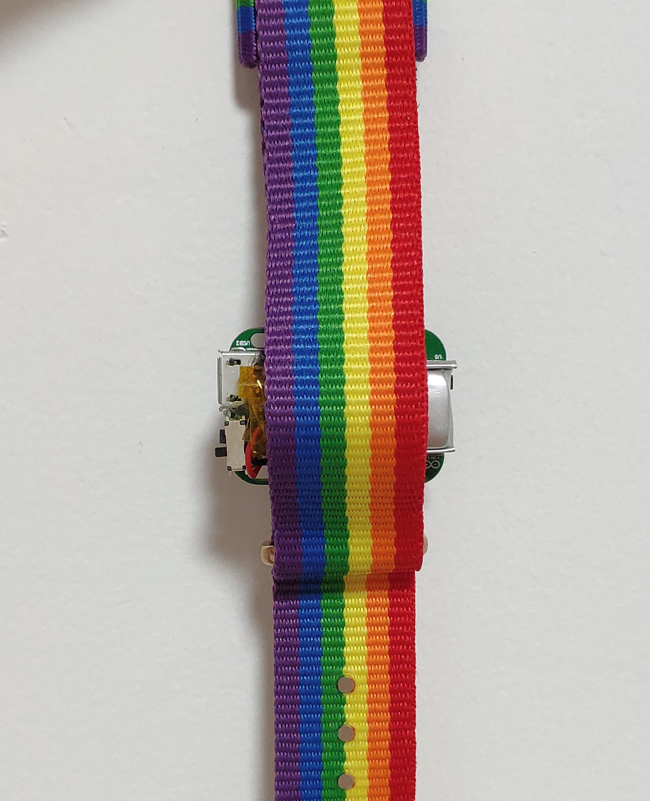
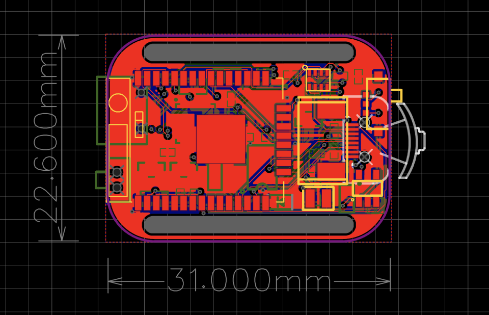
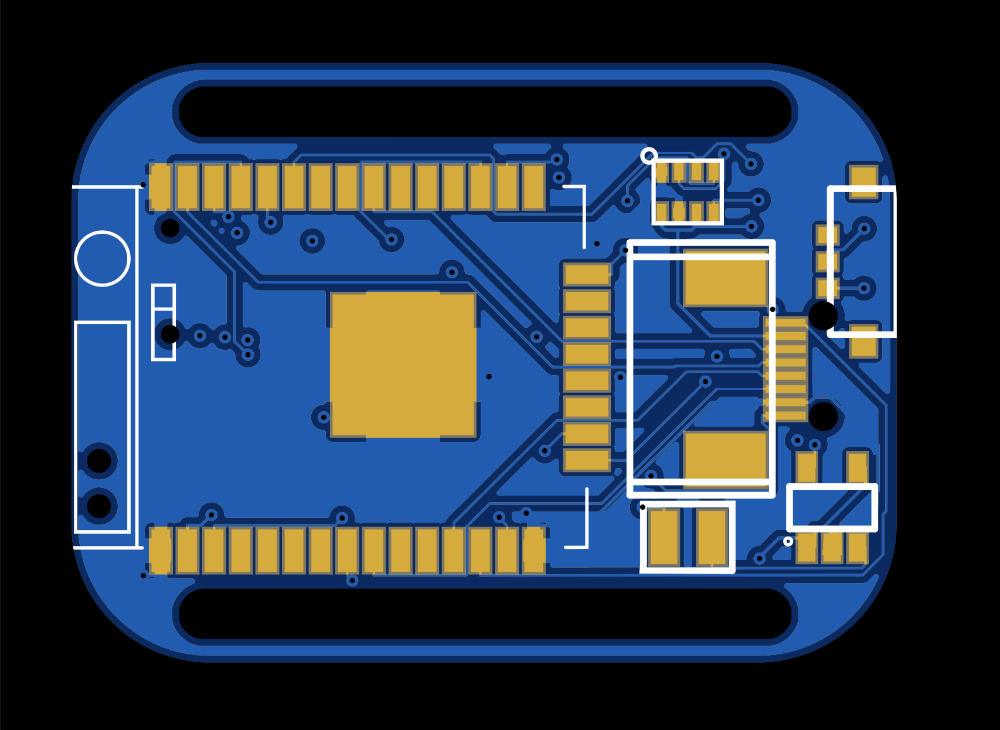
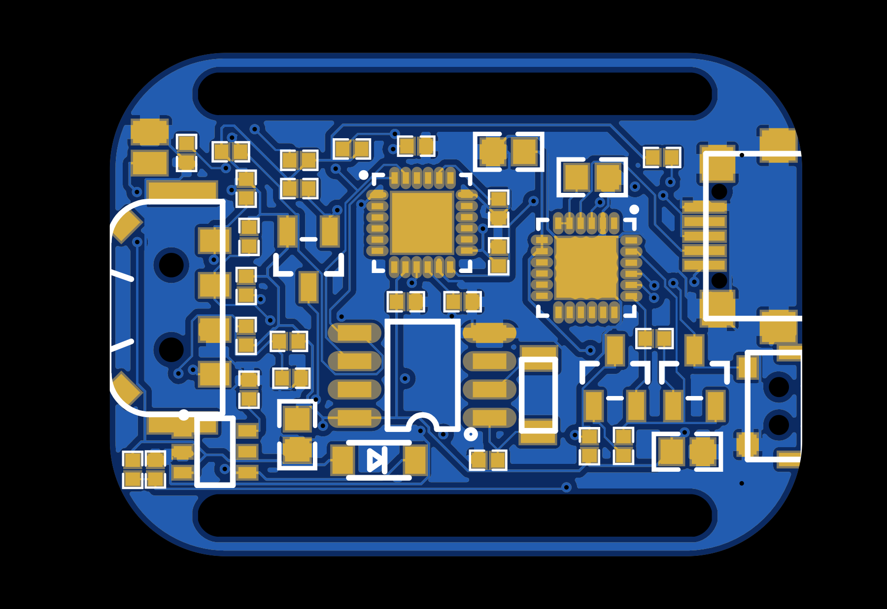

# WatchIO

[原理图Schematic_esp8285-watch.pdf](Schematic_esp8285-watch.pdf)

不多说，上图

# 介绍

- 超迷你尺寸：宽度3.10cm高度2.26cm
- ESP32主控（双核240 MHz 4MB flash）
- 板载Wi-Fi&蓝牙（Wi-Fi支持Station/SoftAP）
- 0.96寸IPS彩屏&PWM背光控制（ST7735驱动/160*80像素）
- Micro USB接口（CP2104串口芯片免驱动）
- 六轴运动传感器（MPU6050 I2C接口）
- 支持Arduino和MicroPython
- RTC实时时钟芯片（PCF8563 I2C接口）
- 气压&温度传感器（BMP280 I2C接口）
- 侧边按钮&多功能按钮（上中下多功能按钮）
- 120mAh Li-Po电池（内置电压ADC检测&充放电电路）

# ESP32 GPIO pins

|  GPIO   | Peripheral  | Notes |
|  ----  | ----  |  ----  |
| GPIO0  | 侧按开关 | Pulled Up, 按下可以在启动时作为flash开关 |
| GPIO12  | 多功能开关Pin1 | Pulled Up |
| GPIO9  | 多功能开关Pin2 | Pulled Up |
| GPIO13  | 多功能开关 按下 | Pulled Up |
| GPIO4  | MPU6050 Interrupt |  |
| GPIO32  | VBAT_SENSOR | 电池电压ADC检测，使用100K和300K电阻分压后给GPIO，GPIO电压是VBAT的四分之三 |
| GPIO33  | TFT_RESET |  |
| GPIO27 | TFT_DC | aka TFT_RS |
| GPIO14 | TFT_CS | |
| GPIO15 | TFT_BACKLIGHT | P-MOS管TFT背光控制，默认上拉不亮，低电平点亮 |
| GPIO23 | TFT_SDA | ESP32 full speed SPI(VSPI) |
| GPIO18 | TFT_SCL | ESP32 full speed SPI(VSPI) |
| GPIO22 | SCL | ESP32 hardware I2C |
| GPIO21 | SDA | ESP32 hardware I2C |

# I2C device addresses

- RTC:
- MPU6050:
- BMP280:

# 备注

- 出厂默认设置忽略了MTDI的strapping pin, 强制烧了efuse配置flash SDIO_VCC是3.3V，这样可以释放出一个GPIO12。命令: espefuse.py set_flash_voltage 3.3V 参考 https://blog.csdn.net/u010631857/article/details/78323512 和 https://github.com/espressif/esptool/wiki/espefuse
 
# 更多图片

