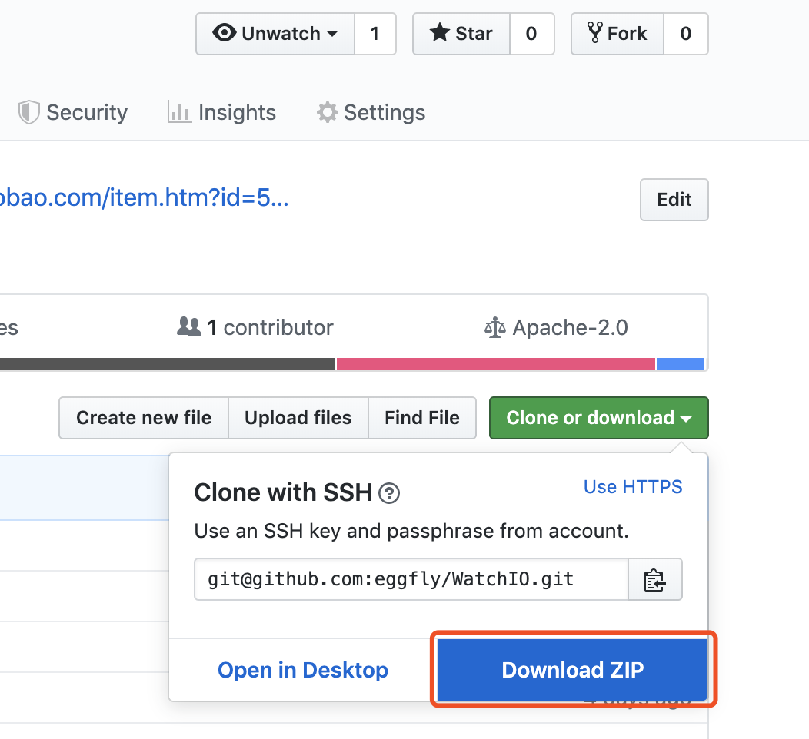
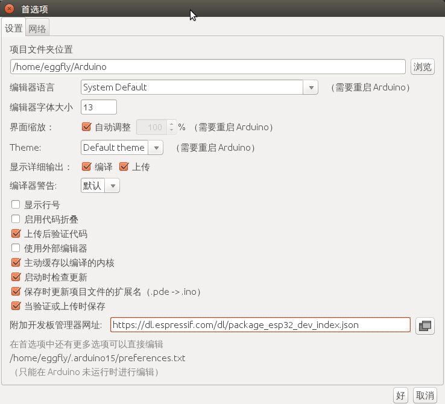
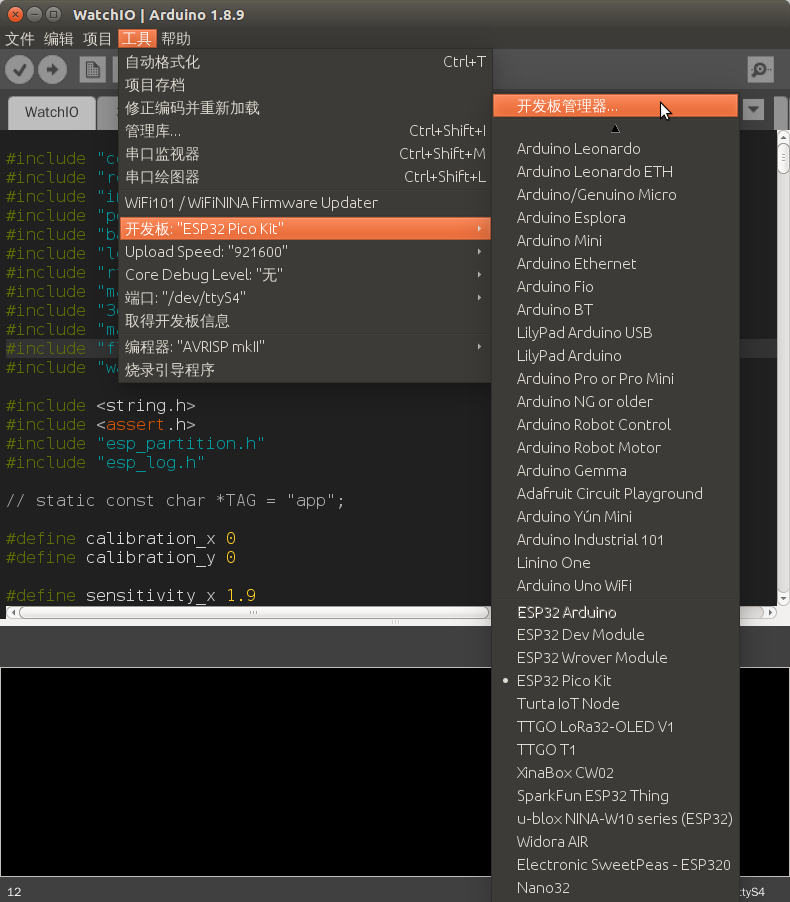
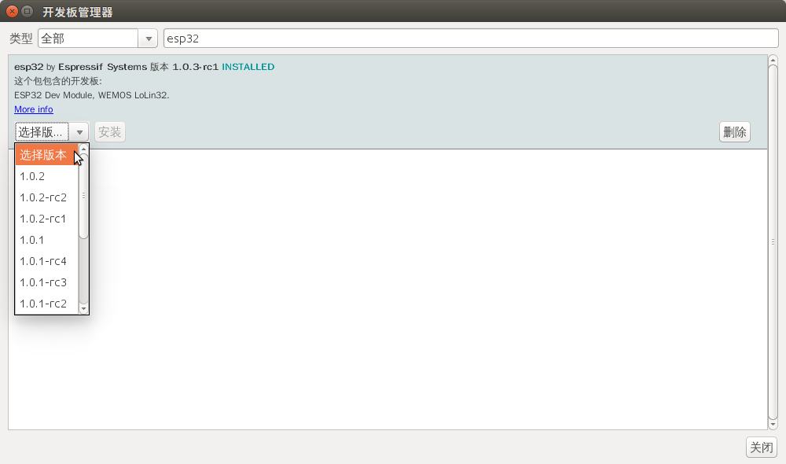
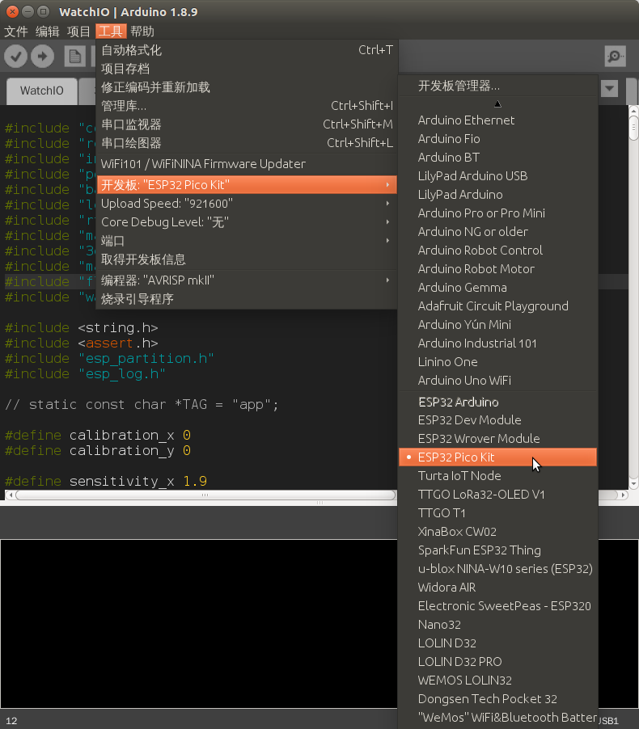
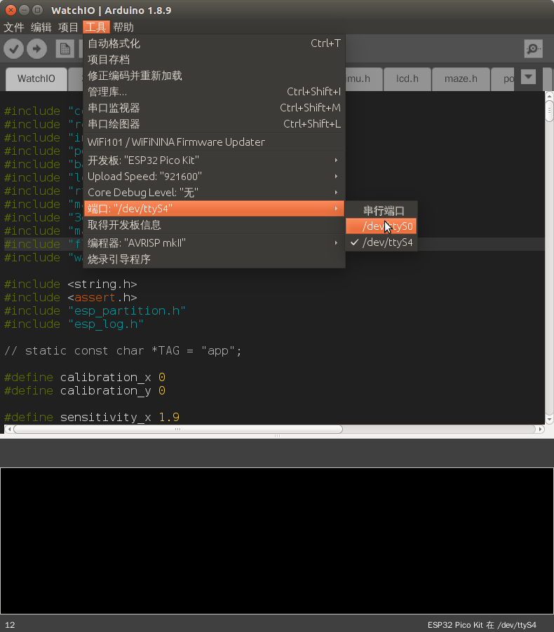

# WatchIO 文档

感谢使用WatchIO进行创作，请仔细阅读以下文档，如果有更多的问题可以用下面二维码加我的微信（添加时备注WatchIO），我拉进开发群一起交流，互相学习。

## 注意事项

- 开关机在侧面的拨动开关，**拨到下面是开机，拨到上面是关机**（锂电池的正极和PCB之间成为断开）
- 如上，如果插入USB给锂电池充电，**需要把拨动开关拨到下面**，才能正常充进去电，否则仅为USB给ESP32供电
- 锂电池充电管理IC是TP4057，充电电流配置为400mA，充电时间大概10-20分钟左右，充满后自动停止充电

## Arduino环境搭建和固件编译

- **下载Arduino:** http://www.arduino.cc
- 下载本github项目的最新版本zip包（git clone也可以）

- 在设置中输入官方esp32的board的json的地址: https://dl.espressif.com/dl/package_esp32_index.json

- 进入开发板管理器

- 在开发板管理器安装ESP32

- 选中开发板中的**"ESP32 Pico Kit"**

- 选择正确的端口(可以拔下USB看下再插入对比多出的串口就是WatchIO)

- 用Arduino打开刚刚下载的当前项目源码目录(src/WatchIO)，点上传按钮等待编译并上传完成!

## ESP32 GPIO pins(WatchIO第一版)

|  GPIO   | Peripheral  | Notes |
|  ----  | ----  |  ----  |
| GPIO0  | 侧按开关 | Pulled Up, 按下可以在启动时作为flash开关 |
| GPIO12  | 多功能开关Pin1 | Pulled Up |
| GPIO9  | 多功能开关Pin2 | Pulled Up |
| GPIO13  | 多功能开关 按下 | Pulled Up |
| GPIO4  | MPU6050 Interrupt |  |
| GPIO32  | VBAT_SENSOR | 电池电压ADC检测，使用100K和300K电阻分压后给GPIO，GPIO电压是VBAT的四分之三 |
| GPIO33  | TFT_RESET |  |
| GPIO27 | TFT_DC | aka TFT_RS |
| GPIO14 | TFT_CS | |
| GPIO15 | TFT_BACKLIGHT | P-MOS管TFT背光控制，默认上拉不亮，低电平点亮 |
| GPIO23 | TFT_SDA | ESP32 full speed SPI(VSPI) |
| GPIO18 | TFT_SCL | ESP32 full speed SPI(VSPI) |
| GPIO22 | SCL | ESP32 hardware I2C |
| GPIO21 | SDA | ESP32 hardware I2C |

## ESP32 GPIO pins(WatchIO第二版)

|  GPIO   | Peripheral  | Notes |
|  ----  | ----  |  ----  |
| GPIO0  | 侧按开关 | Pulled Up, 按下可以在启动时作为flash开关 |
| GPIO12  | 多功能开关Pin1 | Pulled Up |
| GPIO5  | 多功能开关Pin2 | Pulled Up |
| GPIO13  | 多功能开关 按下 | Pulled Up |
| GPIO9 | TP4057充电芯片CHRG脚 | 表示充电状态，Pulled Up |
| GPIO4  | MPU6050 Interrupt |  |
| GPIO32  | VBAT_SENSOR | 电池电压ADC检测，使用100K和300K电阻分压后给GPIO，GPIO电压是VBAT的四分之三 |
| GPIO33  | TFT_RESET |  |
| GPIO27 | TFT_DC | aka TFT_RS |
| GPIO14 | TFT_CS | |
| GPIO15 | TFT_BACKLIGHT | P-MOS管TFT背光控制，默认上拉不亮，低电平点亮 |
| GPIO23 | TFT_SDA | ESP32 full speed SPI(VSPI) |
| GPIO18 | TFT_SCL | ESP32 full speed SPI(VSPI) |
| GPIO22 | SCL | ESP32 hardware I2C |
| GPIO21 | SDA | ESP32 hardware I2C |

## I2C device address

|  Device   | I2C address  | Arduino Library | Notes |
|  ----  | ----  |  ----  | ----  |
|  RTC  | 0x51  | https://github.com/NeiroNx/RTCLib | PCF8563  |
| MPU6050  | 0x68 | https://github.com/tockn/MPU6050_tockn | |
| BMP280  | 0x76 | https://github.com/adafruit/Adafruit_BMP280_Library | 初始化时需指定0x76地址：bmp.begin(BMP280_ADDRESS_ALT) |

## 备注

- 现在WatchIO强制烧了efuse配置flash SDIO_VCC是3.3V，也就是设置忽略了MTDI的strapping pin，这样可以释放出一个GPIO12。
- 命令: espefuse.py set_flash_voltage 3.3V 参考 https://blog.csdn.net/u010631857/article/details/78323512 和 https://github.com/espressif/esptool/wiki/espefuse
